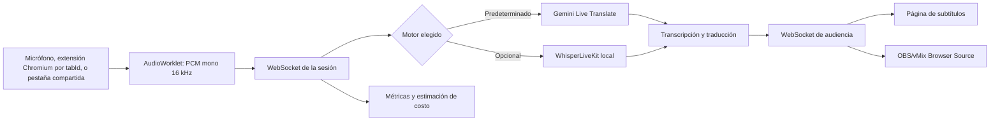

# Nerdearla Live Captions

**Subtítulos y traducción simultánea para conferencias, en tiempo real y con código abierto.**

Nerdearla Live Captions recibe el audio de cada sala, genera transcripción y traducción, y distribuye los subtítulos a una página de audiencia. Está pensado para que una conferencia pueda operar varias salas desde un panel común y publicar el sistema con sus propios recursos.

> **Versión 1 · Nerdearla Vibeathon 2026.** Es un prototipo funcional para evaluar el flujo completo. No reemplaza a intérpretes profesionales ni promete una latencia o precisión fija.

**English summary:** An open-source live captioning and translation system for conference sessions. Each room has an independent audio stream; audiences can view original or translated captions in a web page or OBS/vMix browser source.

## Qué resuelve

Las conferencias necesitan subtitular varias charlas al mismo tiempo sin multiplicar operadores ni contratar un servicio comercial por sala. Este proyecto ofrece una ruta desplegable con Docker, un panel de producción, una página pública de audiencia y una integración principal con Gemini Live. También incluye una ruta local opcional basada en WhisperLiveKit para experimentar con procesamiento autohospedado.

Cada sesión procesa una fuente de audio y transmite el texto resultante a todos sus espectadores. Los espectadores no crean solicitudes adicionales al proveedor.

## Estado de la v1

| Necesidad | Estado en esta versión |
| --- | --- |
| Audio en vivo | Micrófono/consola o audio de una pestaña compatible del navegador, compartida explícitamente por quien opera. |
| Transcripción y traducción | Flujo Gemini Live recomendado; cada sesión configura el idioma de entrada y un destino de traducción. La audiencia puede alternar entre original y ese destino. |
| Varias salas | Sesiones independientes. Se comprobó manualmente en Brave la captura simultánea de dos pestañas de stream (Olga y Luzu). La integración automatizada también comprueba dos sesiones con proveedores simulados; ninguna de estas pruebas demuestra capacidad para 30 salas reales con Gemini. |
| Audiencia | Página web por sala con subtítulos recientes. En esta v1, la persona elige entre el audio original y el único idioma de traducción configurado para esa sesión. |
| Código abierto | Licencia MIT incluida en [`LICENSE`](LICENSE). |
| Glosario y borradores | Disponibles como opciones; implican una ruta contextual con más etapas y consumo de texto. |
| Exportación | VTT, SRT y texto, tanto original como traducido. |
| Producción | Métricas de audio, sesiones, latencia, errores y costo estimado. |
| Subtítulos | Página web por sesión y Browser Source transparente para OBS/vMix. El ejecutable de escritorio queda para más adelante. |
| Procesamiento local | Perfil opcional de WhisperLiveKit; diarización opcional con Sortformer. Requiere dimensionar y probar el hardware. |

## Stack utilizado

- **Interfaz web:** HTML, CSS y JavaScript del navegador, sin framework de frontend.
- **Servidor:** Node.js 22, módulos ES, servidor HTTP nativo y WebSocket con `ws`.
- **Audio del navegador:** Web Audio API y AudioWorklet; la extensión Manifest V3 captura cada pestaña por su ID con `chrome.tabCapture` y procesa el audio en un documento `offscreen`.
- **Transcripción y traducción en la nube:** SDK oficial `@google/genai`; Gemini 3.5 Transcribe Live y Gemini 3.5 Live Translate Preview. La traducción contextual y los borradores usan Gemini 3.5 Flash Lite.
- **Despliegue:** Docker y Docker Compose; el servicio se ejecuta en Node.js sobre Alpine Linux y persiste sesiones en un volumen Docker.
- **Alternativas opcionales:** WhisperLiveKit para ASR local y Sortformer para diarización. Requieren servicios y recursos adicionales.

### Latencia y precisión

En una comprobación manual de una sesión de Gran Sala, la telemetría registró aproximadamente **1,0 s hasta el primer texto reconocido** y **1,2 s hasta la primera traducción** desde el comienzo de la voz. Es una observación puntual de una sala y una conexión; no es un benchmark reproducible ni un SLA.

La latencia y la calidad dependen del modelo seleccionado, el idioma, la red, el micrófono o mezcla de consola, el ruido, los acentos, la cuota disponible y la cantidad de sesiones concurrentes. Gemini Live Translate puede equivocarse en nombres, siglas, cifras, acentos o frases técnicas. Para esta v1 se prioriza demostrar el flujo funcional; mejorar rapidez y precisión requiere comparar modelos y configuraciones con el mismo corpus de audio y revisar los resultados con personas.

## Cómo funciona



El cliente captura audio y lo convierte en PCM mono de 16 kHz en bloques cortos. El backend mantiene sesiones independientes, limita las colas y evita procesar audio demasiado atrasado. Si la conexión se degrada, puede descartar bloques viejos para conservar subtítulos actuales; eso protege la latencia, pero puede perder una parte de lo dicho.

## Requisitos

- Docker Desktop con Docker Compose, recomendado para empezar.
- Una clave de Gemini con acceso al modelo Live que se vaya a usar. La cuota gratuita es limitada y no garantiza disponibilidad ni capacidad para múltiples salas.
- Chrome o Brave actualizado si se va a compartir el audio de una pestaña.
- Git si vas a clonar el repositorio con los comandos de abajo.
- Node.js 22.12 o posterior y `pnpm` solo para ejecutar fuera de Docker o desarrollar.
- Micrófono, entrada de consola o una pestaña que esté reproduciendo audio.

Para compartir la aplicación con otros dispositivos se necesita HTTPS y soporte de WebSocket en el proxy. En `localhost`, el navegador permite probar la captura sin configurar un certificado.

<a id="inicio-rapido-docker"></a>
## Inicio rápido con Docker

Este es el camino recomendado para usar la v1 desde la web en Windows. Necesitás Docker Desktop abierto, Brave actualizado, Git y una clave de Gemini. En PowerShell, cloná el proyecto y prepará la configuración:

```powershell
git clone https://github.com/GiovanniCieri/Nerdearla.git
cd Nerdearla
Copy-Item .env.example .env
notepad .env
```

En `.env`, agregá la clave sin comillas y configurá el nivel de facturación de tu proyecto:

```dotenv
GEMINI_API_KEY=PEGAR_LA_CLAVE_LOCALMENTE
GEMINI_BILLING_TIER=free
```

No publiques ni agregues `.env` al repositorio. Está excluido por `.gitignore`; compartí únicamente `.env.example`, que no contiene claves.

Guardá el archivo e iniciá el servidor:

```powershell
docker compose up --build -d
docker compose ps
Start-Process http://localhost:3001
```

El comando abre el panel web. El puerto del equipo es `3001` por defecto y el contenedor escucha en `3000`. Para seguir los logs mientras opera, abrí otra terminal en la carpeta del repositorio y ejecutá:

```powershell
docker compose logs -f captions
```

En Brave, cargá la extensión una vez: abrí `brave://extensions`, activá **Modo desarrollador**, pulsá **Cargar descomprimida** y seleccioná la carpeta `extension` del repositorio. Fijá **Nerdearla Captura** en la barra de extensiones.

Después seguí el [tutorial de dos salas en Brave](#tutorial-dos-salas-brave). Para los siguientes usos, con Docker Desktop abierto alcanza con:

```powershell
cd Nerdearla
docker compose up -d
Start-Process http://localhost:3001
```

El nivel gratuito de Gemini puede tener cuotas y límites de concurrencia. Configurar `GEMINI_BILLING_TIER=free` sirve para que el panel calcule el costo facturable como cero; no aumenta la cuota disponible.

Para detener el servicio sin borrar las transcripciones guardadas:

```powershell
docker compose down
```

Las sesiones y transcripciones se guardan en el volumen `caption-data`. **No uses `docker compose down -v` si querés conservarlas**, porque también elimina el volumen.

### Ejecución local sin Docker

Instalá Node.js 22.12+, habilitá Corepack y ejecutá:

```powershell
corepack enable
pnpm install
pnpm start
```

Configurá `GEMINI_API_KEY` en `.env` antes de iniciar una sesión real. Esta modalidad usa `http://localhost:3000`. Para desarrollo con recarga automática, ejecutá `pnpm dev`.

Sin Gemini o sin WhisperLiveKit, se puede recorrer el panel con la demo, pero la demo no procesa audio real.

<a id="tutorial-dos-salas-brave"></a>
## Tutorial: dos salas simultáneas en Brave

El flujo comprobado usa **dos ventanas del mismo Brave**: una para el panel web y otra para las pestañas fuente. La aplicación `.exe` queda para más adelante; en esta v1 usá el sistema web.

1. Iniciá Docker y abrí el panel web en Brave: [http://localhost:3001](http://localhost:3001).
2. Abrí una **ventana nueva** de Brave. En esa segunda ventana, abrí una pestaña por cada transmisión; por ejemplo, una para el stream de Olga y otra para el de Luzu. Iniciá sesión en los sitios que lo requieran y comprobá que cada video reproduzca sonido.
3. Instalá una vez la extensión de captura con los pasos de [Inicio rápido con Docker](#inicio-rapido-docker). Dejá el panel en la primera ventana y usá la segunda para operar las pestañas fuente.
4. En la pestaña del stream de Olga, abrí **Nerdearla Captura** desde el ícono de extensiones. Creá una sesión llamada Olga (o elegí una sesión pausada), seleccioná el idioma hablado y el destino, y pulsá **Conectar esta pestaña**.
5. Volvé a la pestaña del stream de Luzu y repetí el proceso con su propia sesión. Cada sesión queda asociada a su pestaña y conserva un flujo de audio separado.
6. Volvé al panel de la primera ventana. Confirmá que ambas salas estén activas y que reciban audio y subtítulos. Abrí la vista de audiencia de cada sesión para revisar la salida.
7. Para detener una fuente, volvé a su pestaña y pulsá **Detener audio de esta pestaña**. La otra sala sigue conectada.

En la prueba manual que logró mantener dos streams en paralelo, se usó este montaje de ventanas en Brave. La extensión toma el ID de la pestaña activa con `chrome.tabCapture`; no depende del selector de pantalla ni de **Compartir esta pestaña** de la barra del navegador. Usá el botón de la extensión dentro de cada pestaña fuente para iniciar o detener solo esa sala.

La misma configuración sirve para YouTube, Swapcard y otras páginas web que reproduzcan audio accesible al navegador. Iniciá la reproducción antes de conectar. DRM, audio bloqueado por el sitio, políticas del navegador o restricciones de la red pueden impedir la captura. Para streams que exijan cuenta, iniciá sesión en Brave antes de conectar la pestaña.

El popup muestra la dirección del servidor, la pestaña activa, las sesiones guardadas y el estado de conexión. En una instalación local, usá `http://localhost:3001`. Si configurás otro dominio, guardalo en el popup y aceptá el permiso que solicita Brave. Para un servidor remoto necesitás HTTPS/WSS.

Si cambiás el ID de la extensión en `extension/manifest.json`, actualizá `CAPTURE_EXTENSION_ID` en `.env` y recreá el contenedor. La extensión envía solo el audio capturado al backend; no almacena el audio en disco. Usa las APIs oficiales de Chrome [`tabCapture`](https://developer.chrome.com/docs/extensions/reference/api/tabCapture) y [`offscreen`](https://developer.chrome.com/docs/extensions/reference/api/offscreen).

Cada pestaña fuente necesita su propia sesión. La extensión evita capturar dos veces el mismo tab ID; el número de sesiones simultáneas que el equipo puede sostener depende de la CPU, la red y las cuotas y límites del motor elegido. Dos salas funcionando no implica que una cuenta gratuita pueda procesar treinta a la vez. Antes de un evento, probá la cantidad de salas prevista y observá señal, subtítulos, latencia, errores y costo en el panel.

En esta v1, el idioma destino se configura al crear cada sesión; la página de audiencia ofrece el audio original o esa traducción. No permite cambiar a un segundo idioma destino mientras la sesión sigue corriendo. La identificación de idioma del modelo también puede confundir idiomas cercanos, como español y portugués, incluso cuando el audio parece claro; revisá las primeras líneas antes de publicar la vista de audiencia.

### Captura alternativa desde el panel

El panel también permite usar un micrófono/consola o abrir el selector estándar para compartir una pestaña. Es útil para una prueba rápida o una fuente, pero para varias salas en Brave usá la extensión siguiendo el flujo anterior. No uses el botón del aviso superior **Compartir esta pestaña** para sumar salas: opera sobre la captura estándar activa.

## Funciones opcionales

### Glosario y traducción anticipada

Se pueden cargar hasta 100 términos por charla: nombres, siglas, proyectos y vocabulario técnico. El glosario usa una ruta contextual con etapas adicionales; puede mejorar términos propios, pero normalmente agrega latencia y consumo. Los borradores anticipados son provisionales y se vuelven a traducir cuando se confirma la frase.

No se presenta una puntuación de “confianza” sin calibración del proveedor. Para precisión, compará transcripciones con una referencia humana y revisá por separado nombres, cifras, negaciones y terminología.

### Subtítulos en OBS o vMix

La sesión ofrece una URL de audiencia que puede agregarse como **Browser Source**. El modo overlay usa fondo transparente y solo muestra las líneas recientes. Reemplazá el ID por el de la sesión:

```text
http://localhost:3001/audience.html?session=ID_DE_SESION&lang=translation&overlay=1
```

Si OBS/vMix está en otro equipo, reemplazá `localhost` por el host accesible y configurá HTTPS/WebSocket. Ajustá resolución, posición y escala desde la fuente del navegador.

### Página de audiencia en otra ventana

Desde una sesión del panel, abrí su vista de audiencia en una ventana aparte para mostrar los subtítulos. También podés copiar la URL de esa sesión para compartirla o usarla como Browser Source de OBS/vMix. El overlay transparente nativo y la aplicación de escritorio `.exe` quedan para una etapa posterior; la v1 recomendada se opera desde el panel web de Brave.

### WhisperLiveKit local y diarización

El perfil local se despliega por separado. La primera compilación descarga modelos; el perfil CPU sirve para evaluar integración y salas pequeñas, **no** demuestra capacidad para una conferencia:

```powershell
docker compose -f docker-compose.yml -f docker-compose.local.yml up --build -d
```

Para activar el respaldo automático cuando Gemini se cae, configurá `AUTO_FALLBACK_TO_LOCAL=true` en `.env`. Para probar diarización con Sortformer:

```powershell
docker compose -f docker-compose.yml -f docker-compose.local.yml -f docker-compose.diarization.yml up --build -d
```

La diarización separa voces como “Voz 1” y “Voz 2”. La sugerencia de nombre requiere una presentación explícita que coincida con la lista de oradores, y producción debe confirmarla. No identifica biométricamente a una persona por su voz. Sortformer y ASR compiten por CPU/GPU; medí memoria y latencia con el hardware final y revisá las licencias de cada modelo descargado.

## Costo, capacidad y escalado

El panel actualiza cada dos segundos una **estimación** basada en audio, modelo y tokens registrados. Presenta minutos procesados, estimación facturable según el nivel configurado, equivalente a tarifa paga y presupuesto diario opcional. No consulta la factura de Google ni garantiza cuota disponible. Los precios y límites cambian; verificá la consola y la documentación del proveedor antes de un evento.

La cuota gratuita puede agotarse o limitar la concurrencia. El audio de Gemini se envía al proveedor; el proyecto no guarda el audio, pero sí persiste transcripciones y estado en el volumen. En nivel gratuito aplican las condiciones de tratamiento de datos de Google. Como no hay autenticación, cualquiera con acceso al servidor puede ver sesiones, textos y costos, e iniciar o eliminar sesiones. No expongas el servicio accidentalmente a Internet.

`MAX_ACTIVE_SESSIONS=30` es un **límite de admisión configurable**, no una promesa de que una instancia o la cuota gratuita puedan sostener 30 salas. La v1 corre en un único proceso: conexiones de modelos y espectadores se mantienen en esa instancia.

Para escalar de manera comprobable:

1. Medí una sala durante una charla real; después probá 2, 5, 10 y 30 fuentes durante períodos representativos, con audiencia conectada.
2. Registrá p50/p95/p99 de captura→primer texto, captura→primera traducción y entrega a audiencia; medí WER, revisión humana, pérdida de paquetes y costo por sala/hora.
3. Comprobá cuota, límites de solicitudes, duración/reconexión del modelo y gasto con el plan real. Ajustá `MAX_ACTIVE_SESSIONS` a la menor capacidad comprobada o cuota disponible.
4. Para varias réplicas, agregá un bus compartido (por ejemplo Redis Pub/Sub), almacenamiento compartido y persistente, afinidad para WebSockets productores y límites de costo por sala.
5. Para ASR/MT local, dimensioná workers y GPU según modelo, VRAM y concurrencia medida; el costo pasa de tarifa por minuto a infraestructura y operación.
6. Probá red degradada, desconexión del productor, 429, reinicio del contenedor y recuperación. La cola corta evita que el retraso siga creciendo, pero la continuidad completa requiere ensayos en el recinto.

## Configuración

Las variables de [`.env.example`](.env.example) incluyen:

| Variable | Para qué sirve |
| --- | --- |
| `GEMINI_API_KEY` | Clave del backend para Gemini. No se expone a la audiencia. |
| `CAPTURE_EXTENSION_ID` | ID Chromium autorizado para CORS y WebSocket; coincide con la extensión incluida. |
| `GEMINI_BILLING_TIER` | `free` o nivel pago; cambia cómo se estima el costo mostrado. |
| `HOST_PORT` | Puerto del equipo para Docker; predeterminado `3001`. |
| `MAX_ACTIVE_SESSIONS` | Máximo de sesiones admitidas por instancia. |
| `MAX_AUDIO_QUEUE_CHUNKS` | Cola de audio antes de descartar bloques atrasados. |
| `DAILY_BUDGET_USD` | Presupuesto diario estimado; `0` lo desactiva. |
| `DRAFT_TRANSLATION_INTERVAL_MS` | Cadencia mínima de borradores. |
| `LOCAL_ASR_WS_URL`, `LOCAL_ASR_TOKEN` | Conexión opcional al servicio local. |
| `AUTO_FALLBACK_TO_LOCAL` | Respaldo a WhisperLiveKit si el perfil local está instalado. |
| `LOCAL_ASR_INFRA_USD_PER_MINUTE` | Tarifa local para la estimación. |
| `LOCAL_SPEAKER_DIARIZATION`, `HF_TOKEN` | Diarización y acceso a pesos si el modelo lo requiere. |
| `TRANSCRIBE_MODEL`, `LIVE_TRANSLATION_MODEL`, `TRANSLATION_MODEL` | Modelos para transcripción, Live Translate y traducción contextual. |

También hay tarifas configurables. No pegues credenciales en issues, capturas, README ni commits.

## API y pruebas

- `GET /api/health`: estado básico del servidor.
- `GET /api/config`: motores y configuración disponibles.
- `GET /api/sessions` y `GET /api/sessions/:id`: sesiones y métricas.
- `GET /api/metrics`, `GET /api/metrics/cost`: monitoreo y estimación.
- `GET /api/sessions/:id/export?format=vtt|srt|txt&language=original|translation`: exportación.
- `WS /ws`: audio del productor y eventos para producción/audiencia.

Comandos de validación:

```powershell
pnpm test
pnpm test:integration
pnpm desktop:smoke
```

La prueba de integración usa proveedores locales simulados: recorre WebSocket, dos sesiones activas, audio PCM, backpressure, diarización, métricas, costos, exportación y persistencia. No consume Gemini y no equivale a una prueba de carga de modelos reales. `pnpm smoke:gemini-setup` verifica Live con Google sin enviar audio, pero sí contacta la API. Para comparar precisión y latencia, seguí [`benchmarks/README.md`](benchmarks/README.md) con audio autorizado y referencias humanas.

## Licencia

El código se publica bajo licencia [MIT](LICENSE). Dependencias, pesos de modelos y servicios externos conservan sus propias condiciones de uso; verificá cada una antes de redistribuir o desplegar.

## Demo y envío a la competencia

**Demo en video (1–2 minutos):** pendiente de grabar y enlazar antes de enviar. Conviene mostrar dos fuentes reales en paralelo, transcripción original, traducción, selector entre audio original y destino configurado y, si alcanza el tiempo, OBS/vMix. Para jurados que no hablan español, agregá subtítulos en inglés.

El link del repositorio público y el del proyecto en Devpost se agregan al realizar esos envíos; no se inventan aquí.

## Autor y contacto

**Giovanni Cieri**

- Teléfono: [+54 9 11 4889-9531](tel:+5491148899531)
- Email: [giovannicieri1@gmail.com](mailto:giovannicieri1@gmail.com)
- LinkedIn: [linkedin.com/in/giovanni-cieri](https://www.linkedin.com/in/giovanni-cieri/)

## Documentación adicional

- [Implementaciones y decisiones tomadas](docs/implementaciones.md)
- [Latencia, calidad y opciones de escalado](docs/latencia-escala-y-calidad.md)
- [Cómo preparar un corpus de evaluación](benchmarks/README.md)
