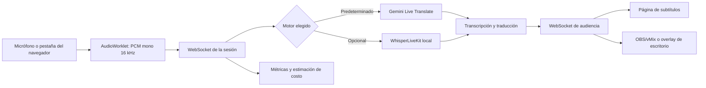

# Nerdearla Live Captions

**Subtítulos y traducción simultánea para conferencias, en tiempo real y con código abierto.**

Nerdearla Live Captions recibe el audio de cada sala, genera transcripción y traducción, y distribuye los subtítulos a una página de audiencia. Está pensado para que una conferencia pueda operar varias salas desde un panel común y publicar el sistema con sus propios recursos.

> **Versión 1 · Nerdearla Vibeathon 2026.** Es un prototipo funcional para evaluar el flujo completo. No reemplaza a intérpretes profesionales ni promete una latencia o precisión fija.

**English summary:** An open-source live captioning and translation system for conference sessions. Each room has an independent audio stream; audiences can view original or translated captions in a web page, OBS browser source, or desktop overlay.

## Qué resuelve

Las conferencias necesitan subtitular varias charlas al mismo tiempo sin multiplicar operadores ni contratar un servicio comercial por sala. Este proyecto ofrece una ruta desplegable con Docker, un panel de producción, una página pública de audiencia y una integración principal con Gemini Live. También incluye una ruta local opcional basada en WhisperLiveKit para experimentar con procesamiento autohospedado.

Cada sesión procesa una fuente de audio y transmite el texto resultante a todos sus espectadores. Los espectadores no crean solicitudes adicionales al proveedor.

## Estado de la v1

| Necesidad | Estado en esta versión |
| --- | --- |
| Audio en vivo | Micrófono/consola o audio de una pestaña compatible del navegador, compartida explícitamente por quien opera. |
| Transcripción y traducción | Flujo Gemini Live recomendado; la interfaz también permite elegir idioma original, destino y detección automática de entrada. |
| Varias salas | Sesiones independientes; el límite de admisión predeterminado es 30. La integración automatizada mantiene dos sesiones activas usando proveedores simulados. Eso comprueba el enrutamiento concurrente, pero **no** demuestra capacidad para 30 salas reales con Gemini. |
| Audiencia | Página web por sala con selector de idioma y ventana de subtítulos recientes. |
| Código abierto | Licencia MIT incluida en [`LICENSE`](LICENSE). |
| Glosario y borradores | Disponibles como opciones; implican una ruta contextual con más etapas y consumo de texto. |
| Exportación | VTT, SRT y texto, tanto original como traducido. |
| Producción | Métricas de audio, sesiones, latencia, errores y costo estimado. |
| Overlay | Página transparente para OBS/vMix y overlay nativo de escritorio con Electron. |
| Procesamiento local | Perfil opcional de WhisperLiveKit; diarización opcional con Sortformer. Requiere dimensionar y probar el hardware. |

### Latencia y precisión

En una comprobación manual de una sesión de Gran Sala, la telemetría registró aproximadamente **1,0 s hasta el primer texto reconocido** y **1,2 s hasta la primera traducción** desde el comienzo de la voz. Es una observación puntual de una sala y una conexión; no es un benchmark reproducible ni un SLA.

La latencia y la calidad dependen del modelo seleccionado, el idioma, la red, el micrófono o mezcla de consola, el ruido, los acentos, la cuota disponible y la cantidad de sesiones concurrentes. Gemini Live Translate puede equivocarse en nombres, siglas, cifras, acentos o frases técnicas. Para esta v1 se prioriza demostrar el flujo funcional; mejorar rapidez y precisión requiere comparar modelos y configuraciones con el mismo corpus de audio y revisar los resultados con personas.

## Cómo funciona



El cliente captura audio y lo convierte en PCM mono de 16 kHz en bloques cortos. El backend mantiene sesiones independientes, limita las colas y evita procesar audio demasiado atrasado. Si la conexión se degrada, puede descartar bloques viejos para conservar subtítulos actuales; eso protege la latencia, pero puede perder una parte de lo dicho.

## Requisitos

- Docker Desktop con Docker Compose, recomendado para empezar.
- Una clave de Gemini con acceso al modelo Live que se vaya a usar. La cuota gratuita es limitada y no garantiza disponibilidad ni capacidad para múltiples salas.
- Chrome o Brave actualizado si se va a compartir el audio de una pestaña.
- Node.js 22.12 o posterior y `pnpm` solo para ejecutar fuera de Docker o desarrollar.
- Micrófono, entrada de consola o una pestaña que esté reproduciendo audio.

Para compartir la aplicación con otros dispositivos se necesita HTTPS y soporte de WebSocket en el proxy. En `localhost`, el navegador permite probar la captura sin configurar un certificado.

## Inicio rápido con Docker

En PowerShell, desde la carpeta del proyecto:

```powershell
Copy-Item .env.example .env
notepad .env
```

En `.env`, agregá la clave sin comillas y configurá el nivel de facturación de tu proyecto:

```dotenv
GEMINI_API_KEY=PEGAR_LA_CLAVE_LOCALMENTE
GEMINI_BILLING_TIER=free
```

No publiques ni agregues `.env` al repositorio. Está excluido por `.gitignore`; compartí únicamente `.env.example`, que no contiene claves.

Construí e iniciá la aplicación:

```powershell
docker compose up --build -d
docker compose ps
docker compose logs -f captions
```

Abrí [http://localhost:3001](http://localhost:3001). El puerto del equipo es `3001` por defecto y el contenedor escucha en `3000`. Para cambiar el puerto del equipo, configurá `HOST_PORT` en `.env`.

Para detener el servicio sin borrar las transcripciones guardadas:
